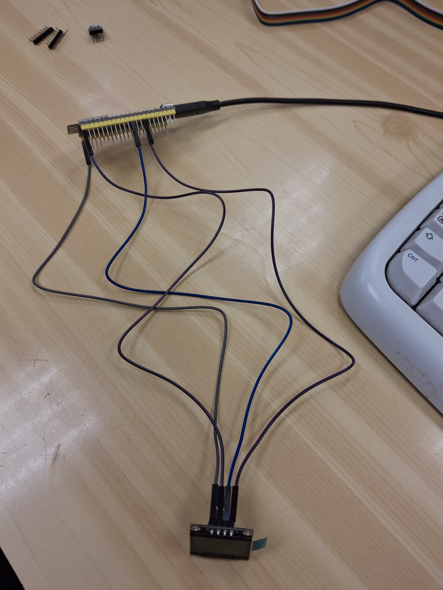

**Sandra Cots** 

**Informe de la Práctica 5: Buses de Comunicación I (I2C)**

**Introducción**

El objetivo de esta práctica es comprender el funcionamiento del bus **I2C**, un protocolo de comunicación ampliamente utilizado para conectar dispositivos periféricos con microcontroladores. Se realizaron dos ejercicios principales:

1. **Ejercicio Práctico 1**: Escáner I2C para detectar dispositivos conectados al bus.
1. **Ejercicio Práctico 2**: Control de un **display OLED SSD1306** mediante I2C.

**Ejercicio Práctico 1: Escáner I2C**

**Descripción**

Este ejercicio consiste en programar un **escáner I2C** que detecta dispositivos conectados al bus y muestra sus direcciones en el puerto serie. Se utiliza la biblioteca Wire.h para la comunicación.

**Código**

#include <Arduino.h>

#include <Wire.h>

void setup() {

`    `Wire.begin();

`    `Serial.begin(115200);

`    `while (!Serial);

`    `Serial.println("\nI2C Scanner");

}

void loop() {

`    `byte error, address;

`    `int nDevices = 0;

`    `Serial.println("Scanning...");

`    `for (address = 1; address < 127; address++) {

`        `Wire.beginTransmission(address);

`        `error = Wire.endTransmission();

`        `if (error == 0) {

`            `Serial.print("I2C device found at address 0x");

`            `if (address < 16) Serial.print("0");

`            `Serial.println(address, HEX);

`            `nDevices++;

`        `} else if (error == 4) {

`            `Serial.print("Unknown error at address 0x");

`            `if (address < 16) Serial.print("0");

`            `Serial.println(address, HEX);

`        `}

`    `}

`    `Serial.println(nDevices == 0 ? "No I2C devices found\n" : "Done\n");

`    `delay(5000);

}

**Salida Esperada**

****

****

**Ejercicio Práctico 2: Control de Display OLED SSD1306**

**Descripción**

Se utiliza un **display OLED SSD1306** para mostrar gráficos y texto a través de I2C. Se emplea la biblioteca Adafruit\_SSD1306.

**Código**

#include <Arduino.h>

#include <Wire.h>

#include <Adafruit\_GFX.h>

#include <Adafruit\_SSD1306.h>

#define SCREEN\_WIDTH 128

#define SCREEN\_HEIGHT 64

#define OLED\_RESET -1

#define SCREEN\_ADDRESS 0x3C

Adafruit\_SSD1306 display(SCREEN\_WIDTH, SCREEN\_HEIGHT, &Wire, OLED\_RESET);

void setup() {

`    `Serial.begin(115200);

`    `if (!display.begin(SSD1306\_SWITCHCAPVCC, SCREEN\_ADDRESS)) {

`        `Serial.println("SSD1306 allocation failed");

`        `while (true);

`    `}

`    `display.clearDisplay();

`    `display.setTextSize(1);

`    `display.setTextColor(SSD1306\_WHITE);

`    `display.setCursor(0, 0);

`    `display.println("Hello, World!");

`    `display.display();

`    `delay(2000);

}

void loop() {}

**Salida Esperada**

El **display OLED** mostrará el texto Hello, World!.

-----
**Ejercicio de Subida de Nota: Monitor de Frecuencia Cardíaca y Oxígeno en Sangre**

**Descripción**

Se utiliza un sensor **MAX30102** para medir la **frecuencia cardíaca** y el **nivel de oxígeno en sangre**, mostrando los resultados en un **display OLED** y en una **página web**.

**Código (Extracto)**

#include <Arduino.h>

#include <Wire.h>

#include "MAX30105.h"

#include "spo2\_algorithm.h"

#include <Adafruit\_SSD1306.h>

MAX30105 particleSensor;

Adafruit\_SSD1306 display(128, 64, &Wire, -1);

void setup() {

`    `Serial.begin(115200);

`    `if (!particleSensor.begin(Wire, I2C\_SPEED\_FAST)) {

`        `Serial.println("MAX30105 not found");

`        `while (true);

`    `}

`    `if (!display.begin(SSD1306\_SWITCHCAPVCC, 0x3C)) {

`        `Serial.println("SSD1306 allocation failed");

`        `while (true);

`    `}

`    `particleSensor.setup(60, 4, 2, 100, 411, 4096);

}

void loop() {

`    `// Lectura y visualización de datos del sensor

}

**Salida Esperada**

- **Display OLED**: Muestra los valores en tiempo real.
- **Página Web**: Muestra los datos de forma remota.

**Conclusiones**

- **I2C**: Es un protocolo eficiente para conectar múltiples dispositivos con pocos cables.
- **Display OLED**: La biblioteca Adafruit\_SSD1306 facilita su uso.
- **Aplicaciones Avanzadas**: Se pueden integrar sensores y displays para sistemas complejos.

